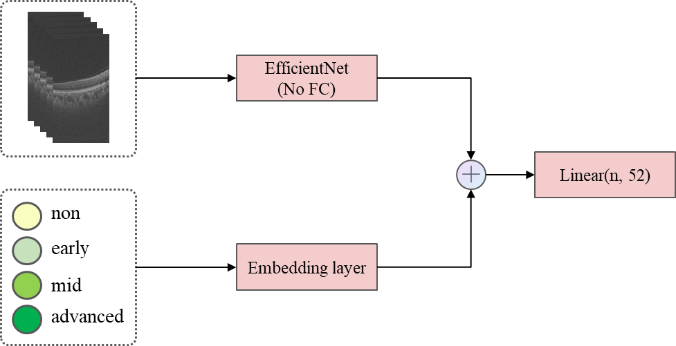
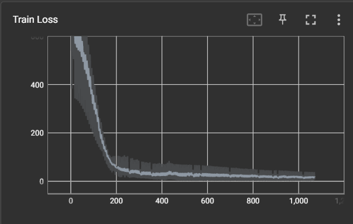

# MICCAI2023 Challenge: STAGE baseline

## 任务二:灵敏度图预测

### 目标

本任务的目的是使用黄斑OCT图像和青光眼分级信息来预测视野报告中的灵敏度图。灵敏度图也称为阈值图，是在视野测试中获得的原始数据，即在每个测试点可观察到的光敏度。自动视野分析仪采用阈值游标强度以dB表示光敏度，其中0dB为最强光敏度，100 dB为最弱光敏度。24-2视野测试共有52个测试点，灵敏度图中的每个点都有对应的光敏度值，该光敏度值代表该测试点所能响应的最弱光敏度。在青光眼分级方法中，如H-P-A法、Millfs法，灵敏度图是重要的分级依据。

具体介绍：https://aistudio.baidu.com/aistudio/competition/detail/968/0/introduction

数据集：https://aistudio.baidu.com/aistudio/competition/detail/968/0/datasets

### 方法

利用一组堆叠切片（从 3D OCT 中切片方向的采样）和青光眼分级信息两种模态的数据，分别输入到 EfficientNet 和 Embedding layer 中。EfficientNet 提取图像特征，Embedding layer 将类别信息映射到一个连续的、稠密的向量特征空间。再将两个特征进行 concat。最后，输入到 Linear 回归头中。如下图：




### 结果

训练过程中 MSE loss（自定义的）的变化：




在官网的测试脚本下四个指标的值：

|          | ave_SMAPE | ave_R2 | ave_MAE | ave_RMSE |
| -------- | --------- | ------ | ------- | -------- |
| Baseline | 0.2271    | 0.0475 | 5.4221  | 6.7454   |


### 使用

- 训练：

```bash
python3 train.py --excel-file STAGE_training/training_GT/task2_GT_training.xlsx --sheet-name 0 --root-dir STAGE_training/training_images --learning-rate 0.0005 --num-epochs 80 --batch-size 4
```

- 推理：

```bash
python3 inference.py 
```
